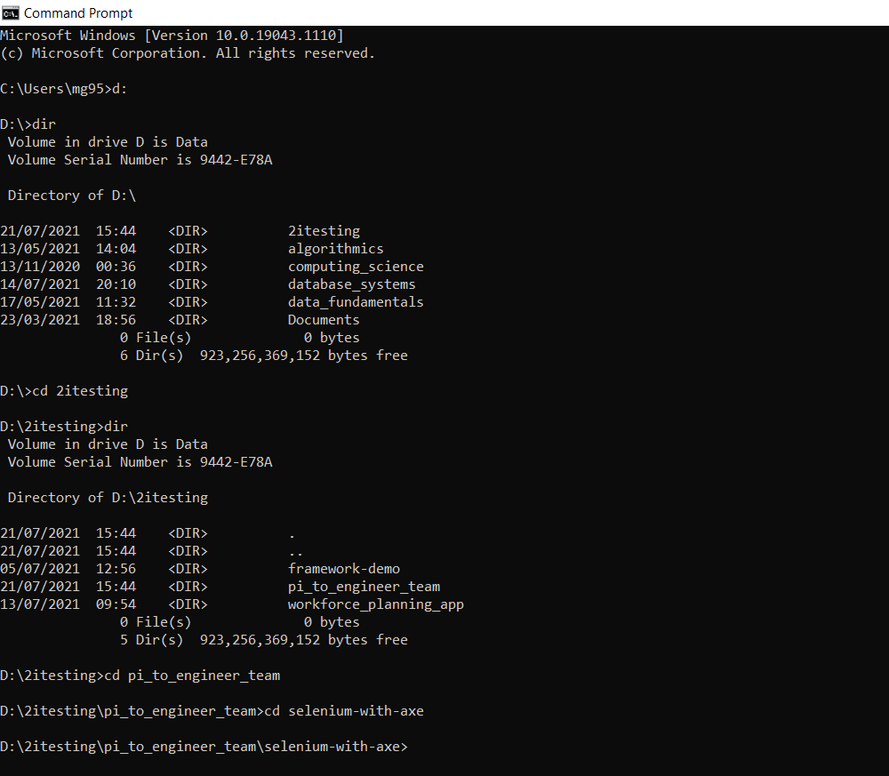
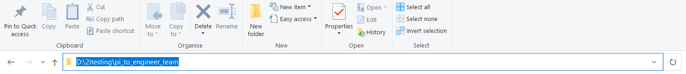
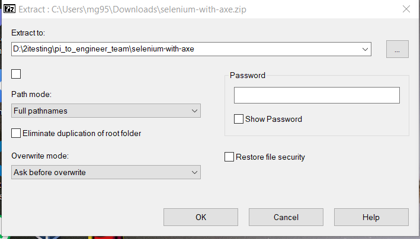
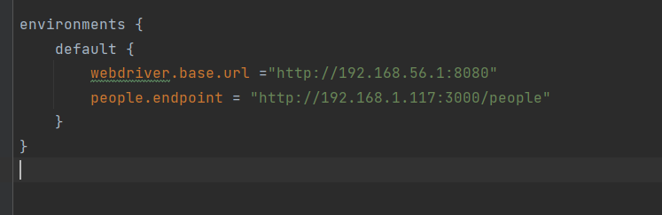
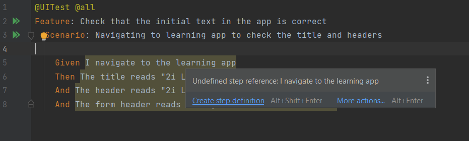
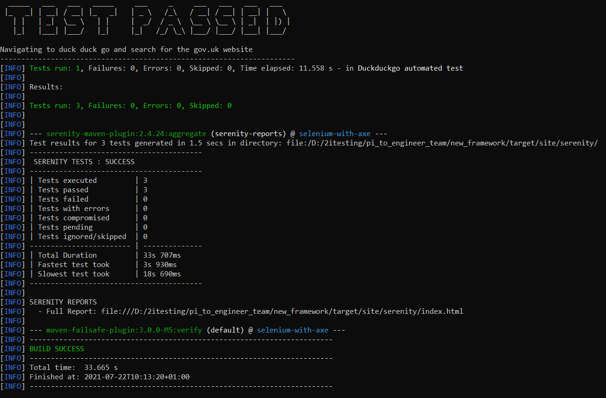

# Testing From A Generated Test Framework
## Selenium Testing Against The 2i Learning App

* You must run the following command before your first time using the framework:
> mvn validate 

## Overview

* This guide will run through the steps involved in setting up a generated testing framework and writing BDD tests against an app. 
* The app we will be testing against is the 2i Learning App.
    * The guide assumes that you have followed the README on the [pi_to_engineering repo](https://github.com/2i-Git/pi_to_engineer_team), and can run the app's front-end and back-end.

* We will start by getting the framework in place and configuring it with the app.
* We will then write and run some basic API and UI tests from within the framework.
    * Some explanation of the different parts involved in the tests will be given, along with references and resources.

* This guide is written for a Windows user.
* The generator requires the use of 7zip to extract the framework from the .zip file.
* We will be using IntelliJ IDEA Community Edition to write our tests.

 

<strong>Installing 7-Zip</strong>

* You can check that you have 7-Zip installed by typing 7-Zip in the Windows Search bar.
* Alternatively you can right-click any file or folder and check that 7-Zip is in the menu.
* If you do not have 7-Zip installed you can install it from [7-zip.org](https://www.7-zip.org/download.html)
    * Select the 64-bit .exe installer and follow the instructions to install.

<strong>Installing IntelliJ</strong>

* You can check that you have IntelliJ installed by typing 'intellij' in the Windows Search bar.
* If you do not, you can install it from [jetbrains.com/idea](https://www.jetbrains.com/idea/download/#section=windows)
    * Select the Community Version .exe installer for Windows.

 

<strong>Navigating the Command Prompt</strong>

In later sections we will have to run code from within a Command Prompt terminal. To do this you need to be able to navigate to the correct folder from within the terminal.

* Open a new Command Prompt by typing 'cmd' in the search bar and selecting Command Prompt

* Navigating to a folder.
    * The folder you are in appears before the flashing cursor.
    * Type dir and hit enter to see what subfolders and files are present.
    * Type cd *foldername* to go to a folder in the current directory.
        * If you start typing a folder name hit *tab* to auto-complete.
        * If you enter the wrong folder, cd .. will take you back to the previous folder.

* An example of what this could look like is shown.

* It is useful to practice navigating through folders in the Command Prompt terminal using the commands above - *however* for a quick shortcut to open a Command Prompt in the folder you desire:
    * Open the folder in File Explorer.
    * Click on the navigation bar at the top of the window.
    * Delete the path text which is highlighted.
    * Type cmd and hit *enter*.

 

## 1. Initial Setup

<strong>1.1 Getting the framework .zip and extracting</strong>

* Download the generated framework .zip file.
    * Go to the email you received from 'Service' titled 'Generated Framework'.
    * Find the attached framework .zip file, right-click and download.
* Extract the framework to the app's root directory.
    * Go to your 'Downloads' folder (or wherever you downloaded the file).
    * Right-click the .zip file and go to 7-zip > Extract Files...
    * In the 'Extract to' field, enter the path to the app's root directory e.g., D:\2itesting\pi_to_engineer_team
        * This can easily be found by opening the folder and clicking on the navigation bar at the top of the window.
        * The names of the folders should collapse into a text path which can then be copied.

        

    * Un-tick the checkbox below next to the folder name as this will create an unnecessary folder.
    * Click Ok to extract the files.

    

<strong>1.2 Checking over what we have</strong>

* Open the framework as a project in IntelliJ.
    * Start IntelliJ.
    * Click Open at the top right to open a new project.
        * If you already have a project open select File > Open...
    * Navigate to the framework folder and open.
* The framework's file explorer should have opened on the left of the window.

We will check over the framework's structure by looking at some sample tests which come with the framework.

* In \src\test we have the 'resources' folder.
    * Here we have the 'features' folder, which holds our Cucumber .feature files. This is split into UI and API folders.
    * Look at 'duckduckgo.feature' in \features\UI to see an example of a UI feature.
    * The serenity.conf file is used to configure the settings of our test framework.

* In \src\test we have the 'java' folder.
    * This is split into UI and API.
    * Each has a folder for storing 'step definitions' and another for storing the functionality of each test.
    * Look at 'UISteps' in \UI\stepdefinitions\UISteps to see example step definitions.
    * You can also check 'DuckDuckGoPage' in \UI\pages to see some functions used to test the UI of the DuckDuckGo page.

Later we will go over how these files work but for now let's run the example tests we have.

<strong>1.3 Running the sample tests</strong>

* Open a Command Prompt terminal in the framework's root folder.
    * See the Navigating the Command Prompt section for help.

* Once you are in the framework folder enter the following command to run the tests:

    > mvn clean verify -Denvironment=default

* You should see the framework's output in the terminal and eventually the sample tests should pass.

Further details about running tests and their outputs can be found in section 3.

<strong>1.4 BDD test structure</strong>

We will run through how the different test files work by looking at the sample duckduckgo UI test.

#### Cucumber Feature Files

The entry point of the test is the [Cucumber]( https://cucumber.io/docs/cucumber/) feature file.
* These files are written in descriptive ‘high level’ language.
* Each feature file should test a different feature of the app.
* A feature can have multiple scenarios which are each broken down into steps of how the scenario is run.

In src\test\resources\features\UI we have the duckduckgo.feature file. 
* We can see a description of the feature to be tested
* We also have a test scenario – opening the duckduckgo website and carrying out a search.
* The scenario is described as individual steps starting with either Given, When or Then.
	* This [cheat sheet]( http://dontcodetired.com/blog/post/Gherkin-Cheat-Sheet) gives an idea of a scenario's structure
* The steps are broken into individual actions so that they can be carried out by a single function.
* The exact phrasing of the step links it to a ‘step definition’ where we define what happens for that step.
* Quotation marks "" are used to send variables to the function.
    * We will see how this works by looking at the step definition.

#### Step Definitions

Step definitions link the description of the step in the Cucumber feature to the function to perform the action. Each definition consists of a line containing the phrasing of the step followed by the function which is to be called for that step.

* We can see some examples in src\test\java\stepdefinitions\UISteps.
* Notice how line 19 matches line 6 from the feature file.
    * The Given tag is removed from the phrase and added as a @Given tag.
    * The caret ^ and dollar sign $ represent the start and end of the phrase respectively.

* Line 20 defines the function which runs to perform the action.
    * In this example, all step definitions are calling upon other functions defined for each Page Object (which we will come on to).

* On line 24 we see an example of a function which has been passed a variable parameter from the feature.
    * \"([^\"]*)\" is a regex placeholder for *any string*.
        * If you want to learn more about regex here's [just enough regular expressions for cucumber](https://agileforall.com/just-enough-regular-expressions-for-cucumber/). 
    * Our example has "HM Revenue & Customs - GOV.UK" in place of \"([^\"]*)\", so the function is called with text = "HM Revenue & Customs - GOV.UK".
    * We could write "BBC - Home" instead which would call the same function with different text.

* The functions which are linked to the step are usually but not necessarily named similarly to the step.
* A step definition function will not return any value. This is indicated by the 'void' return type.
    * It will either do some action within the app or assert that something has happened in the app.

* As mentioned, the step definitions in this example have only one line which calls another function from a Page Object which has been defined previously.

#### Serenity Pages and Functions

* In src\test\java\UI\pages we have our Page Objects
    * These represent pages of the app which we will test against.
    * They hold more complex functionality for running steps.
    * Some functions, like .open(); to open the page, are built into the class.
    * Other functions are added to meet the step definitions.

* In our DuckDuckGoPage we can see examples of defining objects in the page e.g. the search box on lines 12,13.
* We can also see the functions we have added, like enterSearchText on line 20.
    * Our UISteps file imports the necessary Page Objects so that we can access these functions for our step definitions.    

This should all become more clear when we run through writing some tests of our own.

<strong>1.5 Configuring for our app</strong>

* In \src\test\resources open serenity.conf.
* Set the base URL for our app's front end.
    * Find the webdriver.base.url variable which is set to the duckduckgo url.
    * Set this to point to your front-end IP address.
        * This is shown when you start the front-end.
        * The address must be enclosed in quotation marks "".
* Add an endpoint URL for our app's 'people' endpoint.
    * We can remove the 'reqres.endpoint' which was used for the sample tests.
    * Add people.endpoint = "http://*RaspberryPi IP*:3000/people"
        * Replacing *RaspberryPi IP* with the IP address of the Raspberry Pi back-end.

We are now able to write tests against the Learning App's UI and API.
From here on the Learning App's front and back end should be running.

 

## 2. Writing Tests

<strong>2.1 UI Testing</strong>

It's time to start writing our own tests for the Learning App. We'll start out with some UI testing.

First off we'll create a feature file.
* In IntelliJ, open the UI section of our features folder - src\test\resources\features\UI
* Add a new file by right-clicking on the UI folder in the explorer then New > File
* We'll name our file checkBasicText.feature and hit enter.
    * Our first tests will involve opening the app and checking the title and heading are correct.

Now we'll add the contents of the feature.
* Tags allow us to group our features so that we can run certain specified tests if we choose.
    ~~~
    @UITest @all
    ~~~
* In the Feature section we give a brief description of the feature of the app we are testing. Here we are looking to ensure some basic text in the app loads correctly.
    ~~~
    Feature: Check that the initial text in the app is correct
    ~~~
* Now we can define the scenario.
    ~~~
    Scenario: Navigating to learning app to check the title and headers
    ~~~
* Here's where we define the steps of the scenario - the Given, When, Then sections.
* Our Given step will be navigating to the Learning App
    ~~~
    Given I navigate to the learning app
    ~~~
* We will not be carrying out any action on the page for this test so no when statement is needed.
* Our Then steps will check different text on the page.
    ~~~
    Then The title reads "2i Learning App"
    And The header reads "2i Learning App"
    And The form header reads "Add your own data to the API"
    ~~~
    * Notice that 'And' acts as a continuation of the type of step before.

You should notice that the steps are highlighted. This is because there isn't a step defenition defined for them - lets add some...

* Holding the mouse over the first step should bring up the error message and at the bottom you will be prompted to Create Step Definition...
* After selecting this you will be asked to select which file to add the definition to - we will choose UISteps
* You should then be taken to the UISteps file and see that the syntax for the step definition has been added for you.
    * It should appear at the bottom of the file after the already present sample test functionality.
* You'll also notice that it is not doing much.
    * If you look at lines 19, 20 you'll see a similar step definition for navigating to DuckDuckGo.
    * Notice how within the curly brackets we are calling a function to open the page object.
    * We'll need to do the same for the Learning App

So let's create the Learning App page object. Since our file structure will be similar to the DuckDuckGoPage we can copy and paste this file into the same folder.

* Right-click on DuckDuckGoPage and select copy, then right-click on the pages folder and paste.
* Name the file LearningAppPage and hit enter.
    * The name of the class in the new file on line 10 should have changed to LearningAppPage to match the file name but if not you must change it.
    ~~~
    public class LearningAppPage extends PageObject {
    ~~~
* Remove everything from line 12 to 28.
    * We will add our own web elements and functions.

We can now go back to UISteps and have our new step definition open the Learning App page.

* Initialise the page object
~~~
@Steps
LearningAppPage learningAppPage;
~~~
* Call open from within the step definition.
~~~
public void iNavigateToTheLearningApp() {
    learningAppPage.open();
}
~~~
If you look in checkBasicText.feature you will now see the highlighting for the first step has dissapeared meaning the step definition exists.

At this point let's get rid of some of the sample files and code.

* Delete duckduckgo.feature
* In UISteps delete the DuckDuckGoPage initialisation and the 4 functions which reference the duckDuckGoPage object.
    * You can leave the base page stuff in.
* In pages delete the DuckDuckGoPage file.

Continuing on with our step definitions we will start in our feature file again.

* Go to the next highlighted step and create a new step definition.
* This should define the 'theTitleReads' definition.
* This time the function takes a String parameter.
    * Change the name of the parameter 'arg0' to 'title' to make it more readable.

Functionality like checking the page title or header could be used on any page, so we'll define it in the BasePage page object. You will see a function for checking the header has already been defined there.

* Define a similar function for checking the page title.
~~~
public void checkTitle(String title) {
    Assert.assertEquals(title, getDriver().getTitle());
}
~~~

* Call the function from the step definition in UISteps
~~~
@Then("The title reads {string}")
public void theTitleReads(String title) {
    basePage.checkTitle(title);
}
~~~

* Do the same for the next two steps in the feature.
    * The checkHeader function is already defined as mentioned.
~~~
@And("The header reads {string}")
public void theHeaderReads(String header) {
    basePage.checkHeader(header);
}
~~~

* The function for checking the form header must be defined.

src/test/java/UI/Pages/BasePage
~~~
public void checkFormHeader(String header) {
    Assert.assertEquals(header, getDriver().findElement(By.cssSelector("#contact > h3")).getText());
}
~~~
src/test/java/UI/stepdefinitions/UISteps
~~~
@And("The form header reads {string}")
public void theFormHeaderReads(String header) {
    basePage.checkFormHeader(header);
}
~~~
We should now have step definitions for each step of our feature file.
Other features could be:

* adding new people and checking they show up on the page
* deleting people from the page
* trying to add a person with incomplete data

Before we get on to running our tests lets look at API testing.

<strong>2.1 API Testing</strong>

The structure of our API tests will be very similar to our UI tests.

* Feature files with test steps
* An APISteps file with step definitions
* An APIBasePage with further API testing functionality
    * Although we don't use Serenity Page Objects as with the UI tests. We import an API testing package called REST-Assured.

We can modify the ApiTesting feature to perform some tests on the Learning Apps API endpoint.

* Remove the scenario 'GET employee data'
* Add the following scenario
~~~
Scenario: Get the people endpoint
	Given the "people" endpoint is available
	When I set the endpoint
	And I GET the endpoint
	Then I should get 200 back
~~~
This tests that we can successfully recieve data from the endpoint. Response status code 200 signifies a successful request.

The necessary definitions for these steps have already been created for the sample tests. Find them in the APISteps file and check over what's happening.

For more information on REST-Assured functionality, check out [this tutorial](https://www.toolsqa.com/rest-assured-tutorial/).

API tests should usually look at Creation, Reading, Updating and Deletion of data from the database via the API. For now we will move on to look at running the tests.

 

## 3. Running Tests and Framework Output

<strong>3.1 Running Your Tests</strong>

* Open a Command Prompt terminal in the framework's root folder.
    * See the Navigating the Command Prompt section for help.

The command to run all tests is:

> mvn clean verify -Denvironment=default

We can select only certain tests to run by their tags. You will see these tags at the top of the feature files. e.g:

> mvn clean verify -Dcucumber.filter.tags="@UITest" -Denvironment=default

We can also choose to ignore certain tests with "not @', e.g:

> mvn clean verify -Dcucumber.filter.tags="not @apiTest" -Denvironment=default

* Navigate to your framework folder in a Command Prompt and try running the tests.

<strong>3.2 Test Output and Report</strong>

The terminal will output lots of lines as the tests run. Eventually you should be left with a summary of which tests passed or failed.

Given our tests were very basic examples we should hopefully see both pass.

You can scroll back through the terminal to see more detailed feedback. If there are problems with the tests error messages will appear under the steps which caused them.

At the bottom of the output you should see a Serenity Report file.

* Highlight the full report path from file:/// to .html

* Right-click to copy

* Open Chrome Web Browser and paste the path into the address bar.

This will take you to the Serenity report for the tests - giving more readable feedback. A report is produced after every test excecution.

 

 ##Running jmeter performance tests

Create a .jmx file using the Jmeter GUI for testing
Drop the file into the src/test/java/jmeter/jmx directory
Specify your volumetrics & .jmx file name in the JmeterPerformanceTest.feature file
Run: mvn clean verify -Dcucumber.filter.tags="@Jmeter" -Denvironment=default
The output of your performance test will be stored in the src/test/resources/jmeter/outputs directory (this will be date/time stamped to differentiate runs)
Open the index.html file from this folder in your browser to analyse the performance testing run results 

